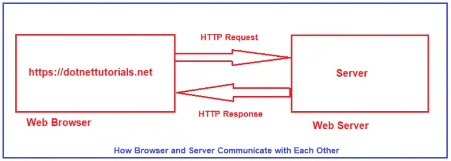
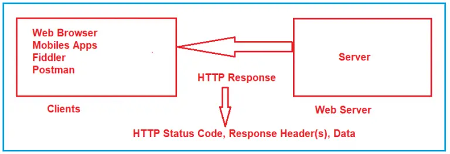

##### **How Browser and Server Communicate with Each Other?**

HTTP stands for HyperText Transport Protocol. HTTP is used for communication between the client and server. Let us understand what it means by client and server with an example.

Suppose, you open the web browser, type the *URL* in the browser and press the enter button. As soon as you press enter, a request is going to the server (called a web server). Whatever data you are sending from the web browser to the web server is called a Request and whatever data you are receiving from the web server is called a Response. This is how the browser and web server communicate with each other in the form of Requests and Responses. And this type of communication is only possible by using HTTP Protocol. So, the request can be termed an HTTP Request and the response can be called HTTP Response. For a better understanding, please have a look at the following image.

Browser is not the only client. For example, if you are using a mobile application, then your mobile is a client. If you are calling APIs using tools like Postman and Fiddler, then Postman and Fiddlers are also the clients.

##### **What is HTTP?**

I have got the following two definitions of HTTP (HyperText Transport Protocol) from Wikipedia,

1. Hypertext Transfer Protocol (often abbreviated to HTTP) is a communications protocol. It is used to send and receive web pages and files on the internet. It was developed by Tim Berners-Lee and is now coordinated by the W3C. HTTP version 1.1 is the most commonly used version today. It is defined in RFC 2616.
2. The Hypertext Transfer Protocol (HTTP) is an application layer protocol for distributed, collaborative, hypermedia information systems. HTTP is the foundation of data communication for the World Wide Web, where hypertext documents include hyperlinks to other resources that the user can easily access, for example by a mouse click or by tapping the screen in a web browser.

#### **HTTP Request Components:**

HTTP (Hypertext Transfer Protocol) is the protocol used for communication between a client (such as a web browser) and a server (such as a web server) over the internet. An HTTP request is made by the client to request a resource from the server, and the server responds with an HTTP response containing the requested resource or an error message.

When we send something from the client (browser, mobile, postman, fiddler, etc.) to the server (webserver) is called a Request. The request is formed with a couple of components. They are as follows:

1. **URL** : Each Request must have a unique URL
2. **Verb (Method):** Each Request must have an HTTP Verb.
3. **Header(s):** Each Request can contain one or more Headers.
4. **Body** : Each request can have a body. The body contains the data that we want to send to the server.

**HTTP Request Components:**

**Request Line:** Specifies the HTTP method, the path of the requested resource, and the HTTP version. For example GET /example/path   HTTP/1.1

**Request Headers:** Key-value pairs that provide additional information about the request. Some common headers include:

* **Host** : Specifies the host and optional port number of the server.
* **User-Agent:** Identifies the client making the request (e.g., the browser or application).
* **Accept:** Indicates the media types the client can handle in the response.
* **Content-Type:** Specifies the media type of the data sent in the request body (for POST or PUT requests).
* **Authorization:** Contains credentials for authentication purposes.

**Request Body (Optional):** Data sent by the client in the case of POST, PUT, or PATCH requests. It carries additional information, such as form data or JSON payload.

#### **HTTP Response Components:**

Whatever we get from the webserver to the clients is called HTTP Response. The HTTP response contains the following components.

1. **HTTP Status Code:** It must have a Status Code.
2. **Response Headers:** It can have one or more response headers.
3. **Data** : Response can have data i.e. return to the client.

Along with the above three components, other components are also there. But the above three components are the important components in an HTTP Response.

**HTTP Response Components:**

**Status Line:** Contains the HTTP version, status code, and a reason phrase. For example HTTP/1.1 200 OK

**Response Headers:** Key-value pairs that provide additional information about the response. Some common headers include:

* **Content-Type** : Specifies the media type of the response body.
* **Content-Length** : Indicates the size of the response body in bytes.
* **Set-Cookie** : Sets a cookie in the client’s browser for session management.
* **Cache-Control** : Specifies caching directives for the response.

 **Response Body** : The actual content of the response, such as HTML, JSON, or binary data.

These components work together to facilitate communication between the client and the server in the form of an HTTP request and an HTTP response. The request contains information needed by the server to understand and fulfill the request, while the response includes the requested resource or an error message for the client to process.

#### **HTTP Verbs or HTTP Methods:**

HTTP verbs, also known as HTTP methods, are a set of standardized actions that can be performed on resources using the HTTP (Hypertext Transfer Protocol) protocol. Each HTTP request typically includes a verb/method to indicate the desired action to be taken. The main HTTP verbs defined in the HTTP/1.1

**GET HTTP Method:**

The GET HTTP Method is used to Retrieve the Data. The HTTP GET method requests a representation of the specified resource. Requests using GET should only be used to request data (they shouldn’t include data). For example, you want to search for something like you want to get a list of employees, a list of products, you want to retrieve a book by id, etc. So, whenever you are expecting some data from the server, you need to use GET HTTP Verb. So, it retrieves a representation of a resource without modifying it. It is a safe and idempotent method

In the case of the HTTP Get Method, the Web API may be expecting some data from the client, but the main purpose of the GET method is to fetch or retrieve data from the server. If you want to implement some kind of search functionality then the Web API may expect some data to filter out the results. In this case, the clients need to send the data

**POST HTTP Method:**

The POST request is used to make a new entry in the database. It is not only specific to a database, whenever you want to create a new resource in your application, then you need to use the POST method. So, It submits data to be processed to a specified resource. It often results in the creation of a new resource or a change in the state of an existing resource. It is not idempotent.

What does it mean by adding a new Resource? It means if you want to add a new Employee, or you want to add a new product. So, here the main concept is not the database, the main concept is adding a new resource.

###### **PUT HTTP Method:**

PUT is also one of the HTTP Verb. The PUT method is used to update all the properties of the current resource in the database. What does it mean? For Example, we have a table called Product in our database. If we want to update all properties of a particular product (i.e. current resource) then we need to use PUT HTTP Request. So, whenever you want to update all the properties (column) of a resource (existing record in the database), then you need to use PUT Method. You cannot add a new resource using the PUT method.

So, it updates or replaces a resource at a specific URI (Uniform Resource Identifier). It is idempotent, meaning that multiple identical requests should have the same effect as a single request.

###### **PATCH HTTP Method:**

There are some situations where you don’t want to update all the properties of an existing resource instead you want to update a few of the properties, then you need to use the PATCH method. So, the PATCH method is similar to the PUT method, but it is used to update a few properties of the current resource in the database. For example, if you want to update a few properties (columns) of an existing product then you need to use the PATCH method. That means if your Product table contains 10 columns, and you want to update only four columns of an existing product, then you need to use the PATCH method.

So, it applies partial modifications to a resource. It is used to update only specific parts of a resource, rather than replacing the entire resource

###### **DELETE HTTP Method:**

The DELETE method is used to delete the resource from the database. It removes a specified resource. That means you are removing or deleting an existing entity from your database. In modern applications, we use two concepts for deletion. One is Soft Delete and the other one is Hard Delete.

1. **Soft Delete:** In your table, if you have some column like IsDeleted or IsActive, or something similar to this and you just want to update that column, then you cannot use Delete Method. In that case, you need to use the PATCH method. This is because you are not deleting the record from the database, you just update the record.
2. **Hard Delete:** If you want to remove the existing entity from the table, then you need to use the DELETE method. For example, Delete an existing product from the Product table in the database, etc.

###### **HEAD HTTP Method**

It retrieves the headers of a resource without retrieving the resource itself. It is used to obtain metadata about a resource.

###### **OPTIONS HTTP Method**

It retrieves the communication options available for a resource or the server as a whole. It is used to determine the supported methods and other capabilities of the server.

These are the most commonly used HTTP verbs, but there are a few less commonly used methods like TRACE and CONNECT. However, they are less relevant for regular web application development. So, there are other HTTP Methods available, but these are the most used HTTP Methods, we generally used in our applications.

#### **HTTP Status Codes:**

The HyperText Transport Protocol status code is also one of the important components of HTTP Response. The Status code is issued from the server and they give information about the response. Whenever we get any response from the server to the client, in that HTTP Response, we must have one HTTP Status code.

Status codes are three-digit numbers that are returned by servers to provide information about the outcome of a request made by a client. These codes are grouped into different categories based on their first digit, which helps in understanding the general class of the response.

1. **1XX** :  **Informational Response (Example: 100, 101, 102, etc.)** .
2. **2XX** : **Successful Response (Example. 200, 201, 203, 204, etc.).**
3. **3XX** :  **Redirection Response (Example. 301, 302, 304, etc.)** .
4. **4XX** :  **Client Error Response (Example: 400, 401, 404, 405, etc.)** .
5. **5XX** :  **Server Error Response (Example: 500, 502, 503, 504, etc.)** .

##### **Frequently used HTTP Status Codes:**

In Web API development, HTTP status codes are an essential part of the response sent by the server to indicate the outcome of a client’s request. Here are some of the frequently used HTTP status codes in Web APIs:

1. **100: 100 means Continue.** The HTTP 100 Continue informational status response code indicates that everything so far is OK and that the client should continue with the request or ignore it if it is already finished.
2. **200: 200 means OK.** The HTTP 200 OK success status response code indicates that the request has been successfully processed, and the server is returning the requested resource in the response body. If you are searching for some data and you got the data properly. That means the request is successful and in that case, you will get 200 OK as the HTTP status code.
3. **201: 201 means a new resource created.** The HTTP 201 Created success status response code indicates that the request has succeeded and has led to the creation of a resource
4. **204: 204 means No Content.** The HTTP 204 No Content success status response code indicates that a request has succeeded, but that the client doesn’t need to navigate away from its current page
5. **301: 301 means Moved Permanently.** If you are getting 301 as a status code from the server, it means the resource you are looking for is moved permanently to the URL given by the Location headers.
6. **302: 302 means Found.** If you are getting 302 as a status code from the server, it means the resource you are looking for is moved temporarily to the URL given by the Location headers.
7. **400: 400 means Bad Request.** If you are getting 400 as the status code from the server, then the issue is with the client’s reques
8. **401: 401 means Unauthorized.** If you are trying to access the resource for which you don’t have access (Invalid Authentication Credentials), then you will get a 401 unauthorized status code from the server.
9. **403: 403  means Forbidden:** This status code is similar to 401, but it specifically indicates that the client is authenticated but does not have sufficient permissions to access the requested resource
10. **404: 404 means Not Found.** If you are looking for a resource that does not exist, then you will get this 404 Not Found status code from the server. Links that lead to a 404 page are often called broken or dead links.
11. **405: 405 means Method Not Allowed.** The 405 Method Not Allowed response status code indicates that the request method is known by the server but is not supported by the target resource.
12. **500: 500 means Internal Server Error.** If there is some error in the server, then you will get a 500 Internal Server Error status code. That means this status code indicates that an unexpected error has occurred on the server while processing the request. It is a generic error response for situations where the server cannot provide a more specific error message.
13. **503: 503 means Service Unavailable.** The 503 Service Unavailable server error response code indicates that the server is not ready to handle the request.
14. **504: 504 means Gateway Timeout.** The 504 Gateway Timeout server error response code indicates that the server while acting as a gateway or proxy, did not get a response in time from the upstream server that is needed in order to complete the request.
