## Web API Project

API Request And Response

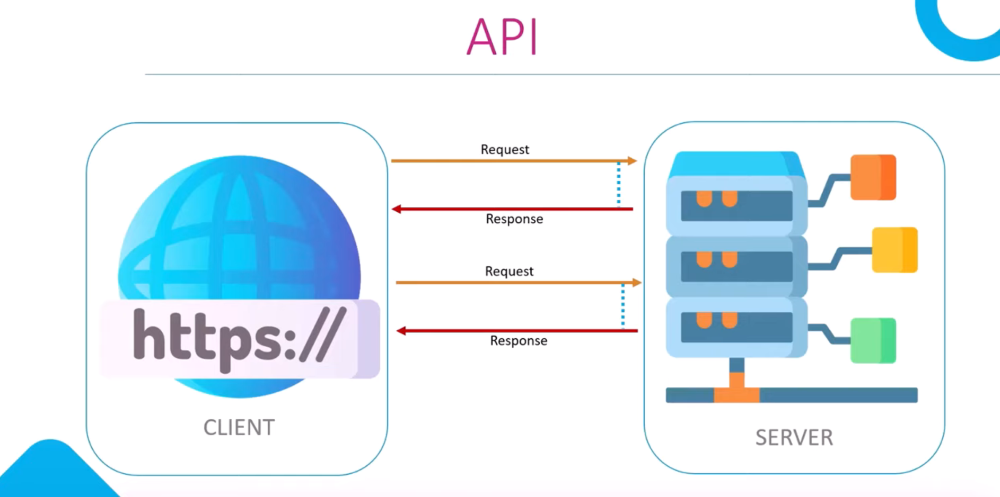

How its work

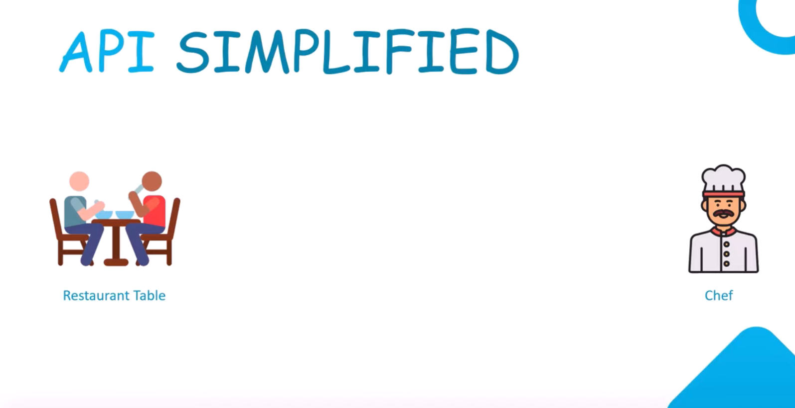

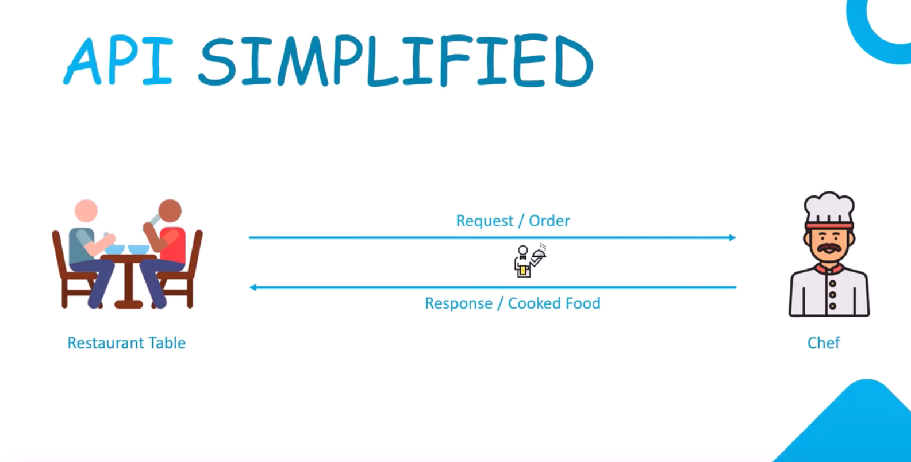


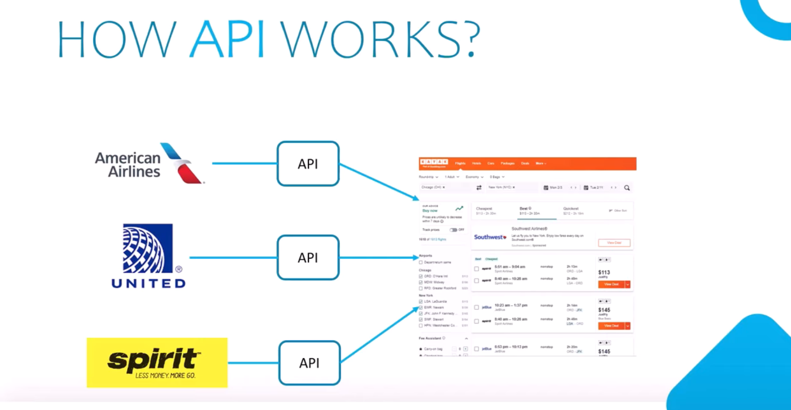

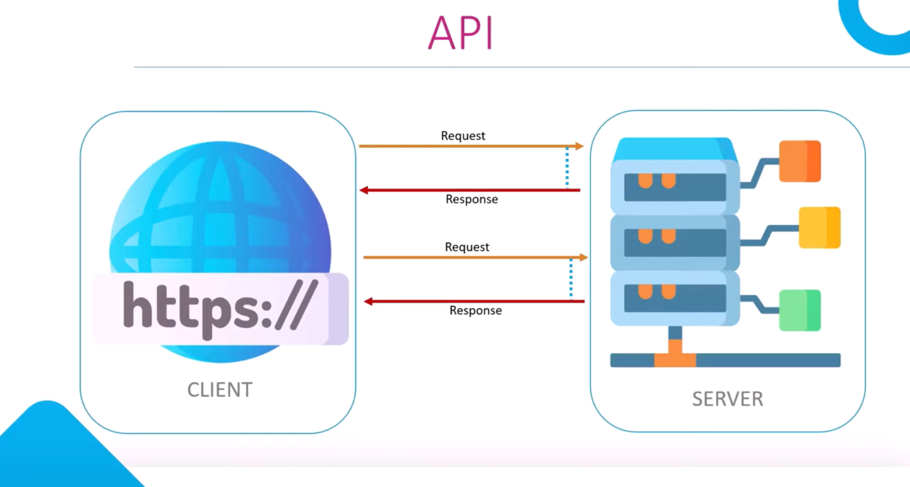

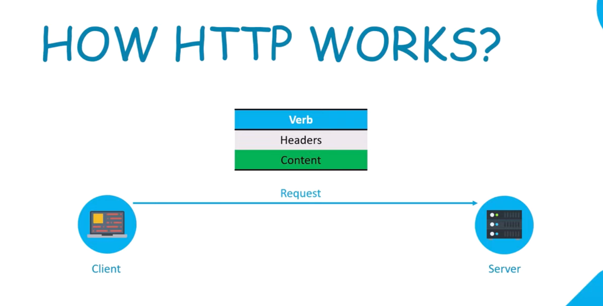

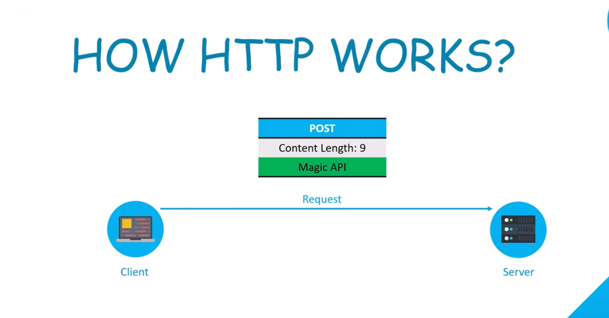

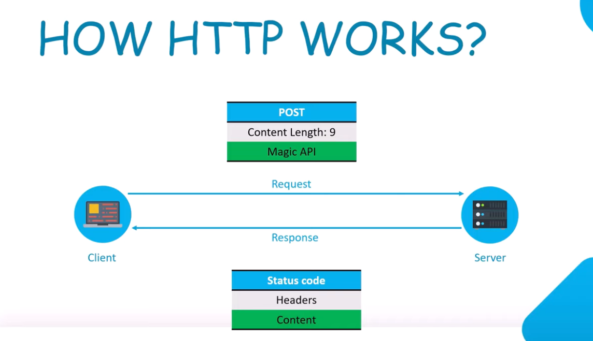

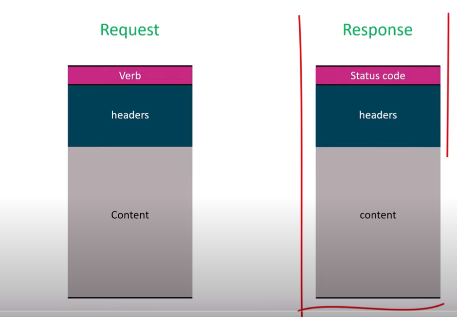

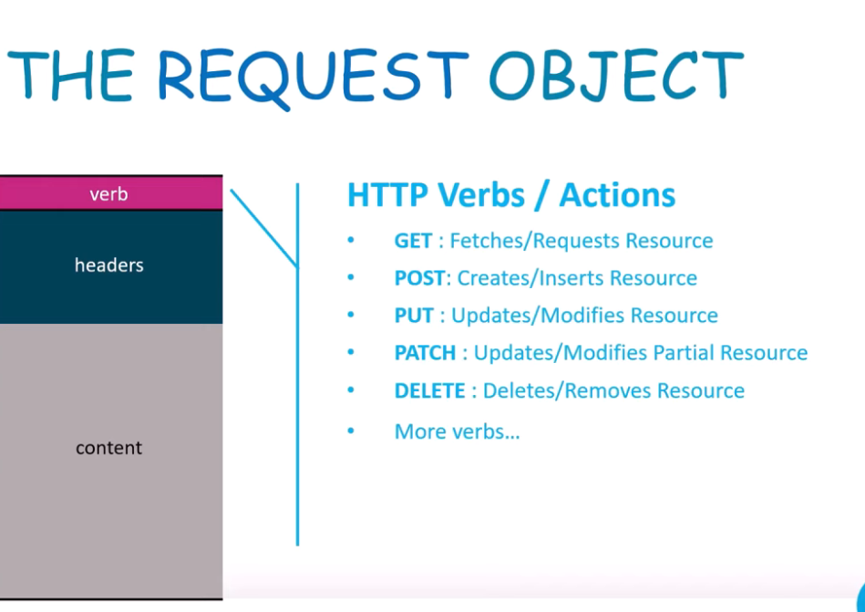

 More Requst Options

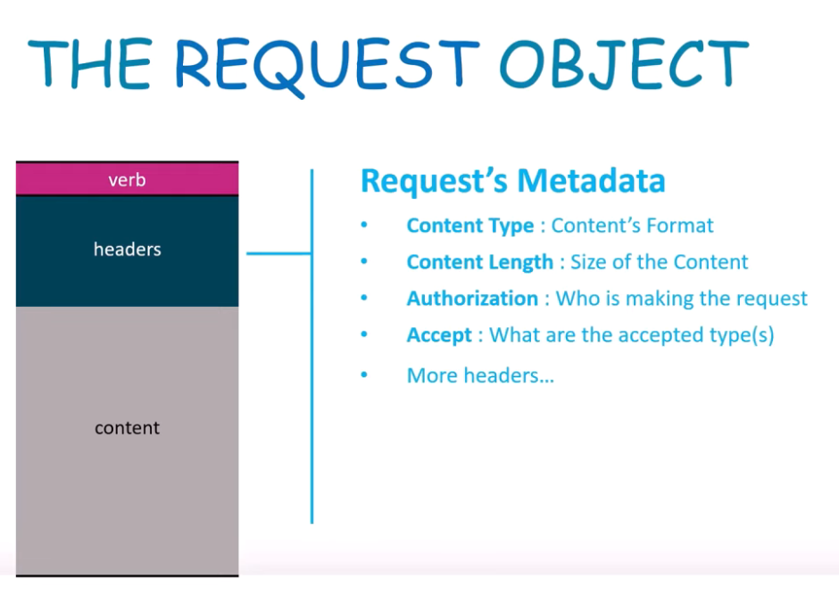

More request Metadata

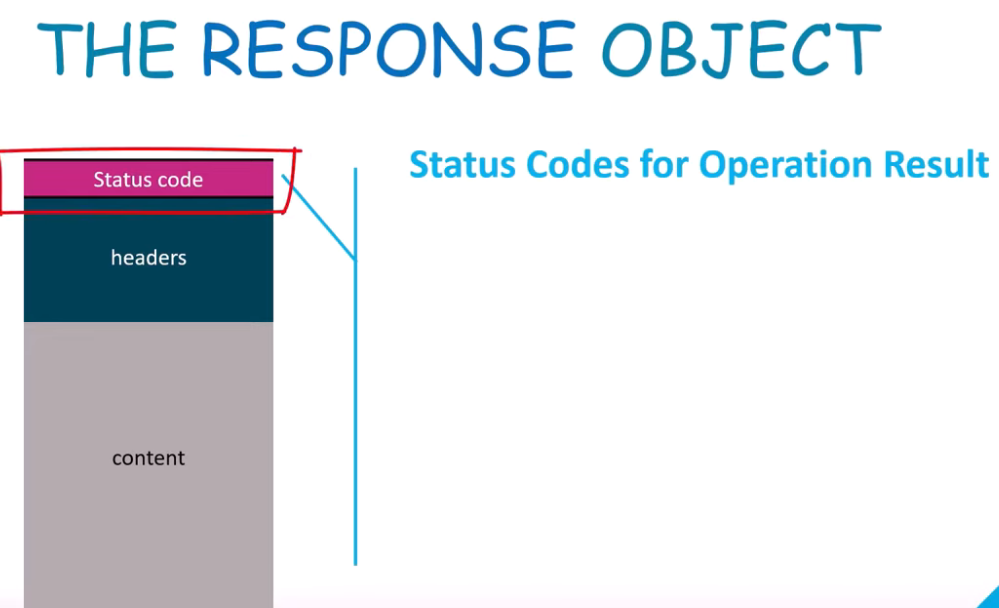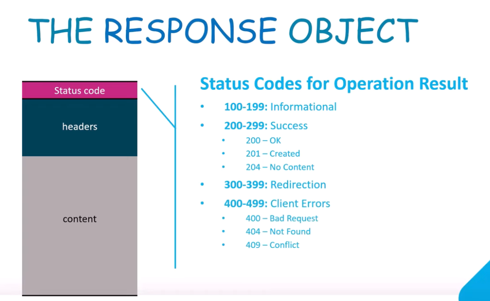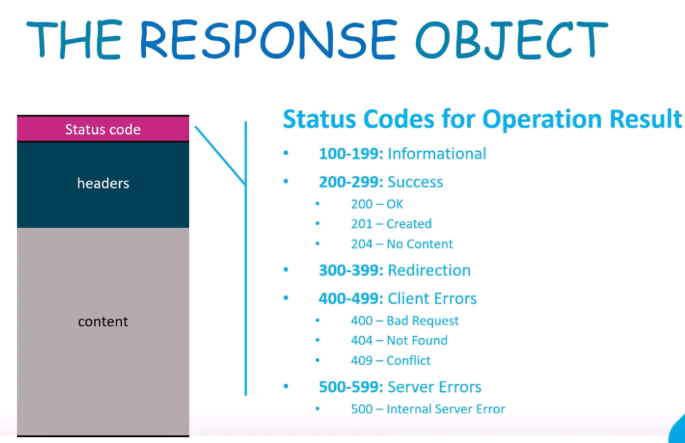

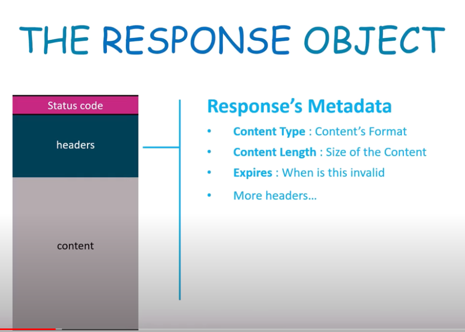

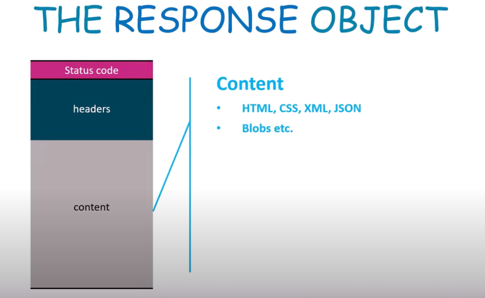

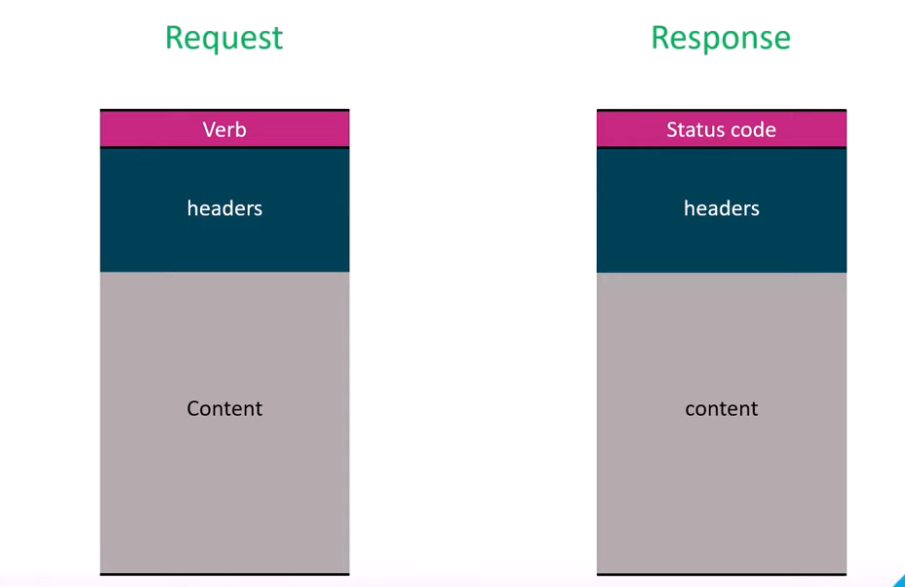

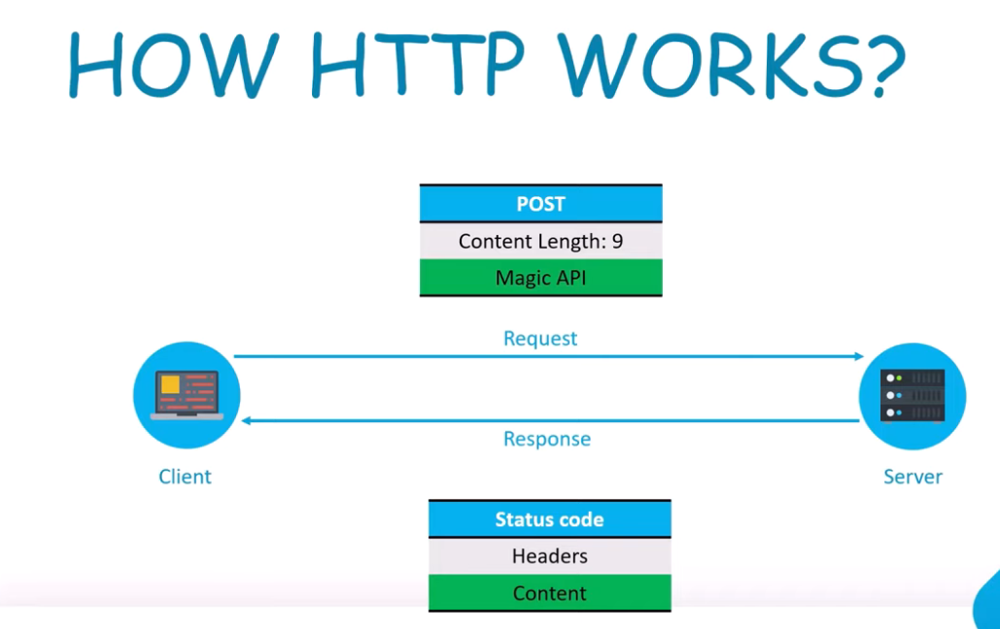

Install Web API

Create A Controller

***[ApiController]***  this attribute by  Model validation Request data and other includes    [More inforamation](https://docs.microsoft.com/aspnet/core/web-api/#apicontroller-attribute)

***ControllerBase***  A base class for an MVC controller without view support. [Get More Inforormation](https://learn.microsoft.com/en-us/dotnet/api/microsoft.aspnetcore.mvc.controllerbase?view=aspnetcore-7.0)

***[Route("/api/v1/[controller]")]***    Attribute Routing in ASP.NET Web API 2   [Get More information](https://learn.microsoft.com/en-us/aspnet/web-api/overview/web-api-routing-and-actions/attribute-routing-in-web-api-2)

```csharp
    [Route("/api/v1/[controller]")]
    //[Route("/api/v1/VillaAPI")]
    [ApiController]
    public class VillaAPIController : ControllerBase
    { 
    }

```

Create Controller with  HTTP GET Method

```csharp
using Microsoft.AspNetCore.Mvc;
using VillaAPI.Data;
using VillaAPI.Models;
using VillaAPI.Models.Dto;
namespace VillaAPI.Controllers
{
    [Route("/api/v1/[controller]")]
    //[Route("/api/v1/VillaAPI")]
    [ApiController]
    public class VillaAPIController : ControllerBase
    {
        [HttpGet]
        public IEnumerable<VillaDto> GetVillas()
        {
            return VillaStore.VillaList;
        }

    }
}

```

Create HttpGetMethod with   Status Code  and route Name

```csharp
      //[Route("{id:int}", Name = "GetVillbyId")]
        [HttpGet("{id:int}" , Name = "GetVillbyId")]
        [ProducesResponseType(200, Type = typeof(VillaDto))]
        [ProducesResponseType(400, Type = typeof(VillaDto))]
        [ProducesResponseType(404, Type = typeof(VillaDto))]
        [ProducesResponseType(500, Type = typeof(VillaDto))]
        public ActionResult<VillaDto> GetVillaById(int id)
        {
            if (id == 0) return BadRequest();
            var singleVilla = VillaStore.VillaList.Where(x => x.Id == id).FirstOrDefault();
            if(singleVilla == null)
            {
                return NotFound();
            }
            return Ok(singleVilla);
        }
```
