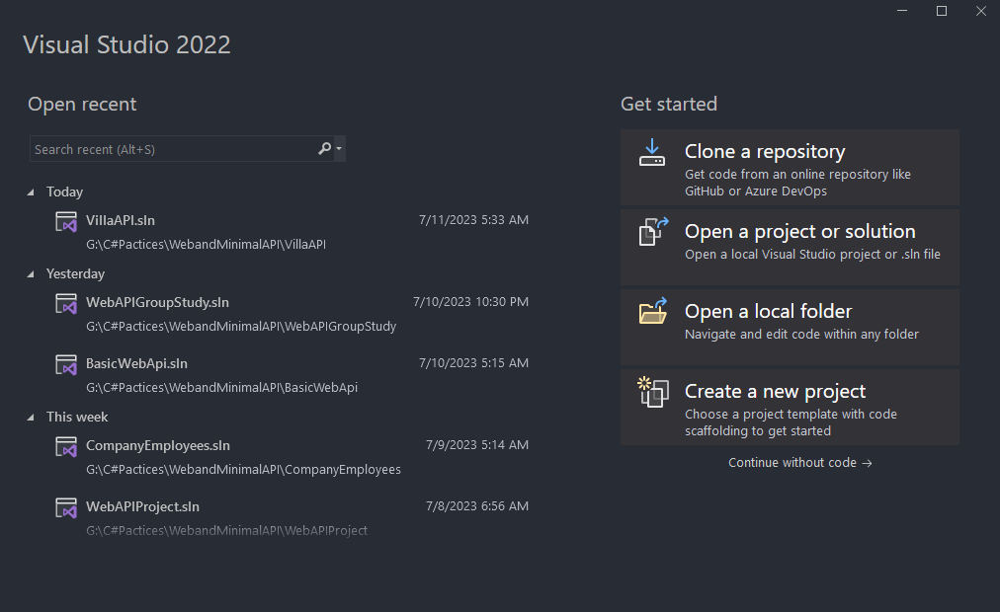
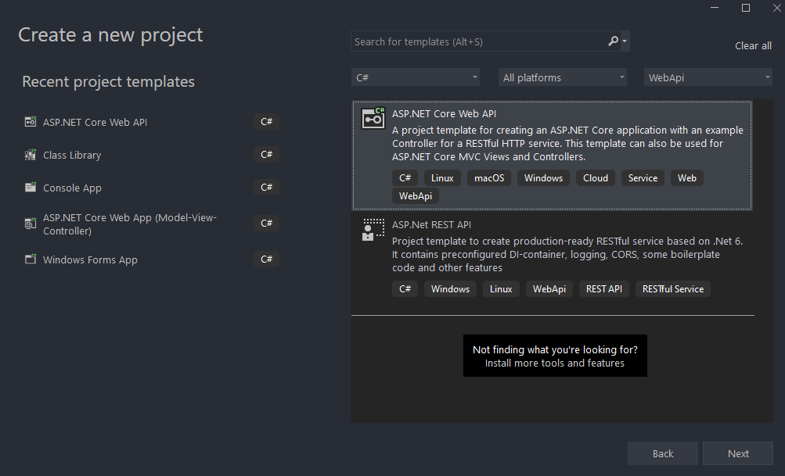
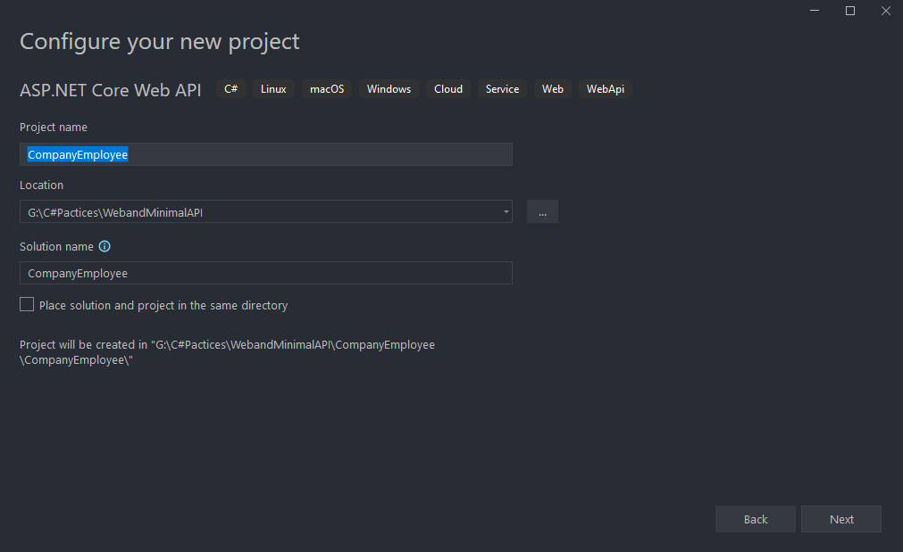

**Create New Project**

Let's open Visual Studio and create a new ASP.NET Core Web Application



Now let's choose a name and location for our project



Next, we want to choose a .NET Core and ASP.NET Core 7.0 from the dropdown lists respectively. Also, we don’t want to enable OpenAPI support right now. We’ll do that later in the book on our own. Now we can proceed by clicking the Create button and the project will start initializing



Configuring  ***launchSettings.json***

After the project has been created, we are going to modify the launchSettings.json file, which can be found in the Properties section of the Solution Explorer window

This configuration determines the launch behavior of the ASP.NET Core applications. As we can see, it contains both configurations to launch settings for IIS and self-hosted applications (Kestrel).

For now, let's change the ***launchBrowser*** property to ***false***to prevent the web browser from launching on application start.

```json
{
  "$schema": "https://json.schemastore.org/launchsettings.json",
  "iisSettings": {
    "windowsAuthentication": false,
    "anonymousAuthentication": true,
    "iisExpress": {
      "applicationUrl": "http://localhost:54295",
      "sslPort": 44308
    }
  },
  "profiles": {
    "http": {
      "commandName": "Project",
      "dotnetRunMessages": true,
      "launchBrowser": false,
      "launchUrl": "swagger",
      "applicationUrl": "http://localhost:5079",
      "environmentVariables": {
        "ASPNETCORE_ENVIRONMENT": "Development"
      }
    },
    "https": {
      "commandName": "Project",
      "dotnetRunMessages": true,
      "launchBrowser": false,
      "launchUrl": "swagger",
      "applicationUrl": "https://localhost:7247;http://localhost:5079",
      "environmentVariables": {
        "ASPNETCORE_ENVIRONMENT": "Development"
      }
    },
    "IIS Express": {
      "commandName": "IISExpress",
      "launchBrowser": false,
      "launchUrl": "swagger",
      "environmentVariables": {
        "ASPNETCORE_ENVIRONMENT": "Development"
      }
    }
  }
}

```

This is convenient since we are developing a Web API project and we don’t need a browser to check our API out. We will use Postman (described later) for this purpose.
If you’ve checked Configure for HTTPS checkbox earlier in the setup phase, you will end up with two URLs in the applicationUrl section — one for HTTP, and one for HTTPS.
You’ll also notice the ***sslPort*** property which indicates that our application, when running in IISExpress, will be configured for HTTPS (port 44308), too.

There is one more useful property for developing applications locally and that’s the ***launchUrl***property. This property determines which URL will the application navigate to initially. For ***launchUrl*** property to work, we need to set the **launchBrowser** property to **true**. So, for example, if we set the **launchUrl** property to **weatherforecast**, we will be redirected to [https://localhost:5001/weatherforecast](https://localhost:5001/weatherforecast) when we launch our application

#### Extension and Cors Methods Configuration

We are going to create a new folder Extensions in the project and create a new class inside that folder named **ServiceExtensions**. The **ServiceExtensions** class should be static.

Let's start by implementing something we need for our project immediately so we can see how extensions work. The first thing we are going to do is to configure CORS in our application. CORS (Cross-Origin Resource Sharing) is a mechanism to give or restrict access rights to applications from different domains.

If we want to send requests from a different domain to our application, configuring CORS is mandatory.

 So, to start off, we ll add a code that allows all requests from all origins to be sent to our API:
